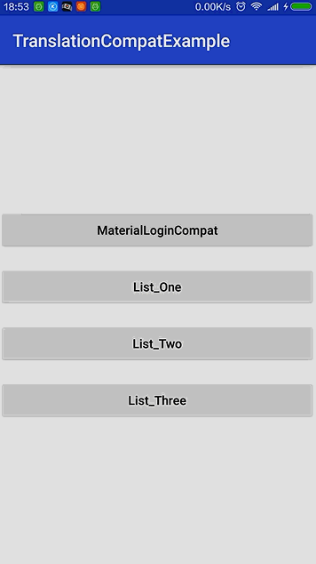
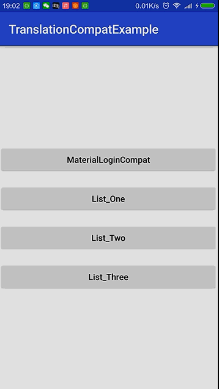

# 页面过渡动画兼容库
>A transition animation compatible Library.

>兼容Android5.0之后转场动画至Android4.0。


# Preview




**原项目地址：[MaterialLogin](https://github.com/fanrunqi/MaterialLogin)
将动画效果兼容至Android4.0**

--


---
# java

```
//参数一：当前Activity
//参数二：跳转意图
//参数三：当前页面跳转至下一页面的View
//参数四：下一页面关联的View id
TransitionController.getInstance().startActivity(this,new Intent(this, RegisterActivity.class),fab,R.id.fab);

//跳转后页面调用：
TransitionController.getInstance().show(this,getIntent());
可在show方法调用之前设置监听：
 TransitionController.getInstance().setEnterListener(new TransitionCustomListener() {
            @Override
            public void onTransitionStart(Animator animator) {
            }
            @Override
            public void onTransitionEnd(Animator animator) {
            }
            @Override
            public void onTransitionCancel(Animator animator) {
            }
        });

//界面退出的时候调用
TransitionController.getInstance().exitActivity(PageDetailActivity.this);

//增加界面圆形转换动画 
// 用法及参数和ViewAnimationUtils一致
ViewAnimationCompatUtils.createCircularReveal(cvAdd, cvAdd.getWidth()/2,0, fab.getWidth() / 2, cvAdd.getHeight());

//增加界面矩形转换动画 
Animator mAnimator = ViewAnimationCompatUtils.createRectReveal( nsv, 0, nsv.getHeight(),ViewAnimationCompatUtils.RECT_TOP);

```
### About me

An Android Developer in ZhengZhou.

【[**我的简书地址**](http://www.jianshu.com/users/3c751e06dc32/latest_articles)】

【[**我的CSDN地址**](http://blog.csdn.net/zhangke3016)】


### Thanks


[MaterialLogin](https://github.com/fanrunqi/MaterialLogin)

[Android 中的转场动画及兼容处理](http://blog.csdn.net/wl9739/article/details/52833668)

[CanEffect](https://github.com/canyinghao/CanEffect)

### License

Copyright  2016  zhangke
Licensed under the Apache License, Version 2.0 (the "License");
you may not use this file except in compliance with the License.
You may obtain a copy of the License at 
http://www.apache.org/licenses/LICENSE-2.0
Unless required by applicable law or agreed to in writing, software
distributed under the License is distributed on an "AS IS" BASIS,
WITHOUT WARRANTIES OR CONDITIONS OF ANY KIND, either express or implied.
See the License for the specific language governing permissions and
limitations under the License.
